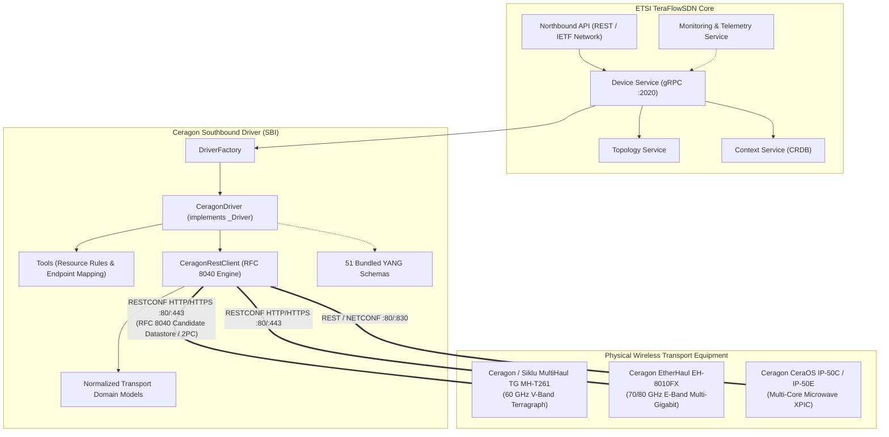
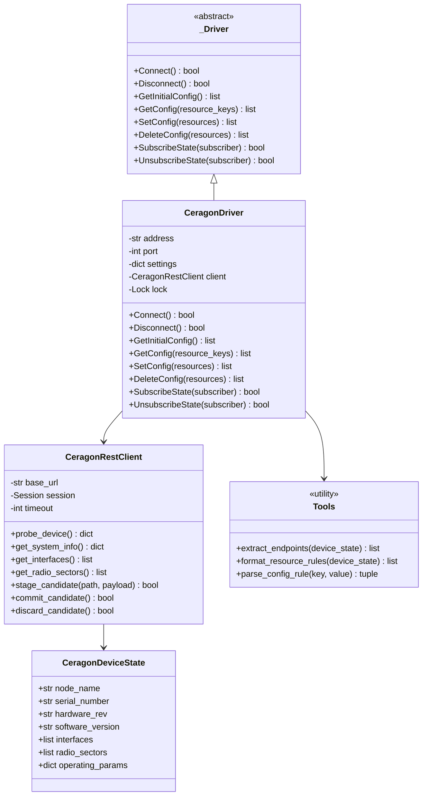
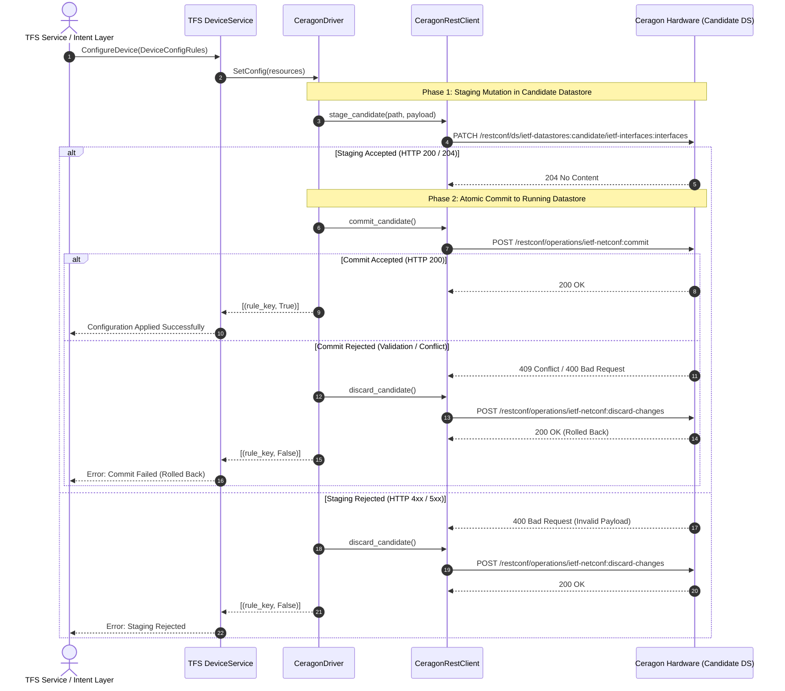

# Ceragon Wireless Transport Southbound Driver Specification

## 1. Executive Summary & Purpose

This document specifies the technical design, architectural interfaces, data models, and operational workflows of the **Ceragon Southbound Driver** (`src/device/service/drivers/ceragon/`) for **ETSI TeraFlowSDN (TFS)**.

The driver provides native SDN control, monitoring, dynamic configuration, and network slicing over Ceragon wireless radio links and transport equipment—including **MultiHaul TG mmWave (Terragraph)**, **EtherHaul E-Band**, and **CeraOS multi-core microwave systems**—using **RFC 8040 RESTCONF** and the **RFC 8342 Network Management Datastore Architecture (NMDA)**.

---

## 2. System Architecture



---

## 3. Class Design & Component Responsibilities



---

## 4. RESTCONF Candidate Datastore & Transaction Management

Ceragon devices employ a candidate datastore engine. Applying configuration changes directly to the running datastore is prohibited by hardware security policies to prevent service interruption during multi-attribute mutations.

### The 2-Phase Commit (2PC) Lifecycle



---

## 5. Supported TFS Configuration Rules & Resource Keys

### 5.1. Connection Management Rules

| Resource Key | Type | Description | Example |
| :--- | :--- | :--- | :--- |
| `_connect/address` | `string` | Target node IPv4 or IPv6 address | `"192.168.1.225"` |
| `_connect/port` | `integer` | RESTCONF management port | `80` (HTTP) or `443` (HTTPS) |
| `_connect/settings` | `dict` | Credentials and connection timeout | `{"username": "admin", "password": "...", "scheme": "http", "timeout": 15}` |

### 5.2. Telemetry & Inventory Rules (Read-Only)

| Resource Key | Return Type | Description |
| :--- | :--- | :--- |
| `/device/hardware_info` | `dict` | Vendor metadata: `{"serial_number": "AE09100255", "hardware_rev": "A0", "software_version": "3.4.0-...", "uptime": "..."}` |
| `/device/capabilities` | `dict` | Device capabilities: `{"vendor": "Ceragon", "model": "MH-T261", "role": "transport_mmwave", "max_throughput_gbps": 1.0, "beamforming": true}` |
| `/device/operating_parameters` | `dict` | Live telemetry: `{"admin_status": "UP", "frequency_ghz": 60.48, "modem_temperature_c": 61, "rf_temperature_c": 58, "tx_power_control": "auto"}` |

### 5.3. Dynamic Control Rules (Read/Write)

#### `/radio/tuning`
Configures carrier channel frequency and ATPC:
```json
{
  "action": 1,
  "custom": {
    "resource_key": "/radio/tuning",
    "resource_value": {
      "sector_id": "rf-sector-1",
      "frequency_mhz": 60480.0,
      "tx_power_control": "auto",
      "target_mcs": 8
    }
  }
}
```

#### `/slice/<slice_name>`
Allocates an IEEE 802.1Q transport slice:
```json
{
  "action": 1,
  "custom": {
    "resource_key": "/slice/slice-uran-6g",
    "resource_value": {
      "vlan_id": 200,
      "bandwidth_mbps": 1000,
      "priority": 7,
      "member_interfaces": ["eth1", "rf-sector-1"]
    }
  }
}
```

#### `/modulation/acm_floor`
Enforces minimum Adaptive Coding and Modulation (ACM) floor for rain fade resilience:
```json
{
  "action": 1,
  "custom": {
    "resource_key": "/modulation/acm_floor",
    "resource_value": {
      "sector_id": "rf-sector-1",
      "min_modulation": "QPSK",
      "min_mcs": 2,
      "atpc_boost_dbm": 3.0
    }
  }
}
```

---

## 6. Bundled YANG Schema Catalog (51 Models)

All 51 RFC-compliant data models bundled in `src/device/service/drivers/ceragon/schemas/yang/` are extracted directly from production hardware:

### A. Radio & Wireless Millimeter-Wave Models
- `radio-bridge-tg-radio-common.yang`: Core radio parameters, channel plans, antenna profiles.
- `radio-bridge-tg-radio-dn.yang`: Terragraph Distribution Node (DN) beamforming and sectors.
- `radio-bridge-tg-acm.yang`: Adaptive Coding and Modulation state machines and hysteresis.
- `radio-bridge-tg-bond.yang`: Wireless link bonding and LAG aggregation.
- `radio-bridge-tg-spider-attenuation-control.yang`: Dynamic RF attenuation and beam shaping.
- `radio-bridge-tg-gps.yang`: Synchronous Ethernet and GPS timing synchronization.

### B. Transport & Bridging Models
- `radio-bridge-tg-interfaces.yang`: Physical port and radio interface definitions.
- `radio-bridge-tg-user-bridge.yang`: User plane Ethernet bridging and VLAN isolation.
- `radio-bridge-tg-tunnel.yang`: Point-to-Point and Point-to-Multipoint transport tunneling.
- `radio-bridge-tg-cfm.yang`: IEEE 802.1ag Connectivity Fault Management (CFM).
- `ieee802-dot1q-cfm.yang`, `ieee802-dot1q-cfm-types.yang`, `ieee802-dot1q-types.yang`: Standard IEEE 802.1Q definitions.

### C. System, OAM & Maintenance Models
- `radio-bridge-tg-system.yang`: System hostname, location, operational mode.
- `radio-bridge-tg-inventory.yang`: Hardware inventory, board revisions, serial numbers.
- `radio-bridge-tg-software-upgrade.yang`: Dual-image software upgrade and bank switching.
- `radio-bridge-tg-rollback.yang`: Automatic configuration rollback timer.
- `radio-bridge-tg-pm.yang`: Performance monitoring and 15-min / 24-hr historical bins.
- `radio-bridge-tg-events.yang`, `radio-bridge-tg-logging.yang`: Alarm and syslog notifications.

### D. IETF & Standard Base Models
- `ietf-datastores.yang`: RFC 8342 NMDA datastore definitions.
- `ietf-yang-library.yang`: RFC 8525 YANG library module catalog.
- `ietf-restconf.yang`: RFC 8040 RESTCONF protocol definitions.
- `ietf-netconf.yang`, `ietf-netconf-nmda.yang`, `ietf-netconf-acm.yang`: Netconf access control and operations.
- `ietf-interfaces.yang`, `ietf-ip.yang`, `ietf-inet-types.yang`, `ietf-yang-types.yang`: Standard network primitives.

---

## 7. Quality Assurance & Test Verification

The driver includes a comprehensive test suite in [`src/device/tests/test_driver_ceragon.py`](../src/device/tests/test_driver_ceragon.py) covering:

| Test Case | Method Verified | Success Criteria |
| :--- | :--- | :--- |
| `test_driver_lifecycle` | `Connect()` / `Disconnect()` | Session creation, keepalive verification, idempotent teardown. |
| `test_get_initial_config` | `GetInitialConfig()` | Accurate extraction of inventory and generation of TFS `EndPoint` structures. |
| `test_get_config` | `GetConfig()` | Telemetry retrieval for operating parameters, temperatures, and link metrics. |
| `test_set_config_radio_tuning` | `SetConfig()` | Candidate staging of frequency tuning and atomic commit. |
| `test_set_config_slice_creation` | `SetConfig()` | Dynamic IEEE 802.1Q sub-interface creation and token-bucket bandwidth reservation. |
| `test_set_config_acm_floor` | `SetConfig()` | Enforcing ACM minimum modulation floor for rain-fade mitigation. |
| `test_candidate_datastore_rollback`| `SetConfig()` | Validates execution of `discard-changes` when candidate staging rejects payload. |
| `test_yang_schema_availability` | `schemas` module | Confirms presence, integrity, and readability of all 51 YANG definitions. |
