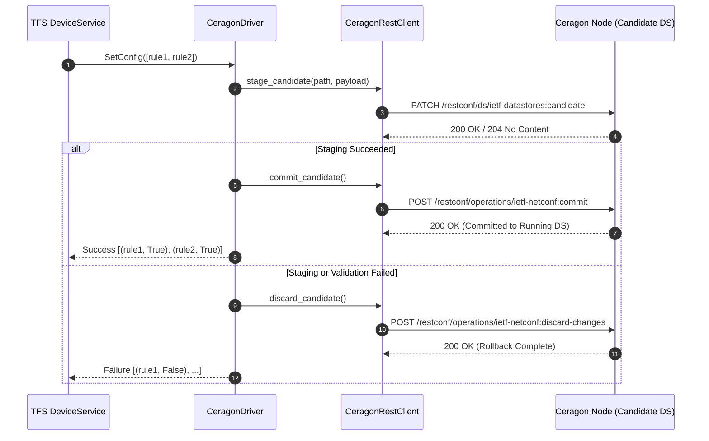

# Ceragon Wireless Radio Transport Driver for ETSI TeraFlowSDN

The **Ceragon Southbound Driver** (`src/device/service/drivers/ceragon/`) enables ETSI TeraFlowSDN to natively discover, monitor, configure, and manage Ceragon wireless radio links and millimeter-wave transport equipment via RFC 8040 RESTCONF.

---

## 1. Module Structure

```
src/device/service/drivers/ceragon/
├── __init__.py               # Exports CeragonDriver
├── CeragonDriver.py          # Main TFS driver implementation (_Driver subclass)
├── client.py                 # RFC 8040 RESTCONF client with 2-phase candidate datastore commit
├── models.py                 # Transport domain models (RadioSector, NetworkInterface, SliceConfig)
├── templates.py              # Candidate datastore JSON/XML payload templates
├── Tools.py                  # Endpoint generation and TFS resource rule parser
├── README.md                 # This documentation file
└── schemas/                  # 51 RFC-compliant YANG data models
    ├── __init__.py           # Schema accessor utilities
    └── yang/                 # Raw YANG definitions extracted from physical hardware
        ├── radio-bridge-tg-*.yang
        ├── ieee802-dot1q-*.yang
        └── ietf-*.yang
```

---

## 2. Supported Hardware

| Family | Model Series | Spectrum | Max Throughput | Transport Role |
| :--- | :--- | :--- | :--- | :--- |
| **MultiHaul TG** | `MH-T261`, `MH-T280`, `MH-N366` | 57–66 GHz (V-Band) | Up to 3.8 Gbps | mmWave Mesh / PtMP / Terragraph |
| **EtherHaul** | `EH-8010FX`, `EH-2500FX`, `EH-1200` | 70/80 GHz (E-Band) | Up to 10 Gbps | Ultra-High-Capacity PtP Carrier Link |
| **CeraOS Microwave** | `IP-50C`, `IP-50E`, `IP-20C`, `IP-20N` | 6–42 GHz (Microwave) | Up to 20 Gbps | Multi-Core Long-Haul & Backhaul |

---

## 3. Supported TFS Configuration Rules

The driver processes TFS `ConfigRule` structures dispatched by the TFS Device Service.

| Resource Key | Action | Type | Description |
| :--- | :--- | :--- | :--- |
| `_connect/address` | Read/Write | `string` | IP address or hostname of the Ceragon node (e.g. `192.168.1.225`). |
| `_connect/port` | Read/Write | `integer` | RESTCONF management port (Default: `80` for HTTP, `443` for HTTPS). |
| `_connect/settings` | Read/Write | `dict` | Connection options: `{"username": "admin", "password": "...", "scheme": "http", "timeout": 15}`. |
| `/device/hardware_info` | Read-Only | `dict` | Inventory metadata: serial number, hardware revision, software version, uptime. |
| `/device/capabilities` | Read-Only | `dict` | Transport capabilities: supported bands, beamforming profile, max throughput. |
| `/device/operating_parameters` | Read-Only | `dict` | Live telemetry: frequency, modem/RF temperatures, ATPC state, admin status. |
| `/radio/tuning` | Write | `dict` | Tunes radio frequency (`frequency_mhz`), channel, and transmit power. |
| `/slice/<slice_name>` | Write / Delete | `dict` | Creates/deletes IEEE 802.1Q VLAN sub-interfaces, bridges, and bandwidth limits. |
| `/modulation/acm_floor` | Write | `dict` | Sets minimum ACM modulation floor (e.g. `MCS2` / `QPSK`) during severe rain fade. |

---

## 4. RESTCONF Candidate Datastore & 2-Phase Commit

Ceragon devices implement the RFC 8342 Network Management Datastore Architecture (NMDA) with a candidate datastore engine. All mutations must follow a strict transactional workflow to prevent partial state corruption:



---

## 5. Driver Lifecycle Details

### `Connect()`
- Initializes a persistent `requests.Session` with HTTP Basic Authentication.
- Verifies datastore reachability via `/restconf/data/ietf-yang-library:yang-library`.
- Thread-safe and idempotent.

### `GetInitialConfig()`
- Queries `/restconf/ds/ietf-datastores:candidate/ietf-system:system` and inventory modules.
- Generates TFS `EndPoint` structures for all physical copper ports (`eth1`, `eth2`) and wireless radio sectors (`rf-sector-1`).
- Populates initial resource rules (`/device/hardware_info`, `/device/capabilities`, `/device/operating_parameters`).

### `GetConfig(resource_keys)`
- Queries operational state for requested keys:
  - Thermal sensors (modem temp, RF temp)
  - RSSI, SNR, and modulation levels
  - Port operational status (`UP` / `DOWN`), speed, and MTU.

### `SetConfig(resources)`
- Maps TFS resource rules into candidate datastore payloads via `templates.py`.
- Stages changes in candidate datastore.
- Executes atomic commit.
- Triggers automatic rollback (`discard-changes`) if any operation fails.

### `DeleteConfig(resources)`
- Removes VLAN bridges and sub-interfaces created by network slices.
- Re-tunes radio parameters to defaults when slice reservations terminate.

---

## 6. Running Unit Tests

Execute the driver unit tests with pytest:

```bash
# From repository root:
PYTHONPATH=src pytest -v src/device/tests/test_driver_ceragon.py
```

**Test Coverage**:
- `test_driver_lifecycle`: Connect and Disconnect verification.
- `test_get_initial_config`: Inventory parsing and endpoint generation.
- `test_get_config`: Telemetry extraction (temperatures, frequency, ATPC).
- `test_set_config_radio_tuning`: Channel frequency tuning with 2-phase commit.
- `test_set_config_slice_creation`: IEEE 802.1Q VLAN slicing and rate limiting.
- `test_set_config_acm_floor`: Adaptive modulation floor hardening.
- `test_candidate_datastore_rollback`: Verifies `discard-changes` on simulated HTTP error.
- `test_yang_schema_availability`: Asserts all 51 physical YANG models are bundled and parseable.

---

## 7. Device Onboarding Example

Create a descriptor file (e.g., `manifests/ceragon_mh_t261_descriptor.json`) and upload via TFS REST API:

```bash
curl -X POST http://localhost:8088/api/v1/devices \
  -H "Content-Type: application/json" \
  -d '{
    "devices": [
      {
        "device_id": {"device_uuid": {"uuid": "ceragon-mh-t261-ctu-96"}},
        "device_type": "microwave-radio-system",
        "device_config": {
          "config_rules": [
            {"action": 1, "custom": {"resource_key": "_connect/address", "resource_value": "192.168.1.225"}},
            {"action": 1, "custom": {"resource_key": "_connect/port", "resource_value": "80"}},
            {"action": 1, "custom": {"resource_key": "_connect/settings", "resource_value": {
              "username": "admin", "password": "admin", "scheme": "http", "timeout": 15
            }}}
          ]
        },
        "device_operational_status": 1,
        "device_drivers": [22],
        "device_endpoints": []
      }
    ]
  }'
```
